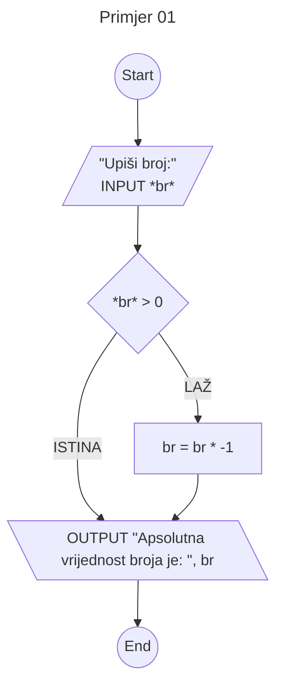

[← Natrag na početnu](../../README.md#uvod-u-programiranje)

# Uvod u programiranje

## Opterećenje

1 ECTS -> 30 sati rada
UUP -> 7 ECTS
 - 50 sati predavanja
 - 20 sati LV
 - 140 sati samostalan rad (10 sati tjedno)

## Materijali
Dostupno u mapi Materijali/Upute
> [!Important]
> obavezno pročitati

## Samostalni rad
 - Vodiči u [Edgaru](https://edgar.fer.hr) - pripreme za predavanja
 - Rješavanje zadataka
   - Compiler s C11 support

## LV i Ispiti
 - Preko Edgar sustava
 - Kontinuirana nastava do veljače
   - 4LV po ciklusu
 - u 11. mj MI (30 bodova)
 - ZI (40 bodova)
 - LV (30 bodova)
   - Na LV su Windowsi: GCC compiler (MinGW) i rudimentarni tekst editor
   - Provjere na LV pišu se na računalima u labosu
 - Ispiti (MI i ZI)
   - open book principa, pišu se na vlastitiom laptopu
 - Ispitni rokovi
   - Zimski, Ljetni, Jesenski, Dekanski

## Algoritam
 - konačan, djelotvoran, potpuno određen
 - Može se opisati:
   - Prirodnim jezikom
   - Pseudo kodom
   - dijagramom toka
   - programskim jezikom
     - rječnik i skup gramatičkih pravila kojima se računalu opisuje algoritam

## Hardware
 - fizičke komponente
   - procesor
   - memorija
     - primarna (RAM) ns, volatile
     - sekundarna (HDD, SDD) $\mu$s, non volatile
   - ulazno/izlazne jedinice
     - tipkovnica, zaslon, miš


## Primjer jednostavnog zadatka

Učitaj broj i izračunaj njegovu apsolutnu vrijednost.



```c
#include <stdio.h>

// Primjer 01

int main() {
	int a;
	scanf("%d", &a);

	if (a < 0) a *= -1;

	printf("Apsolutna vrijednost broja je: %d\n", a);

}
```
